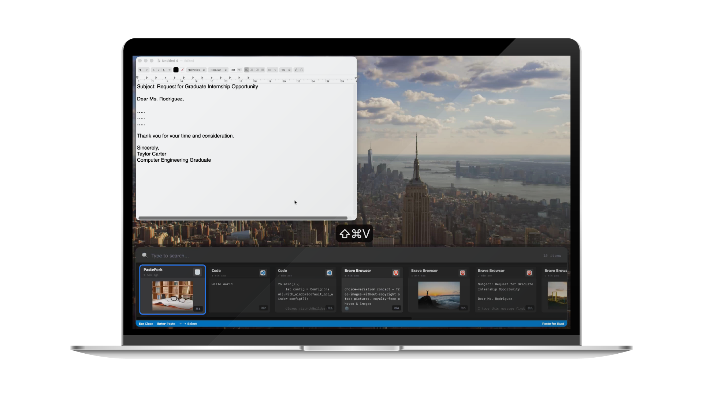

# Paste-Fork

This is a macOS application written using the [Dioxus Framework](https://dioxuslabs.com/), designed to replicate the functionality of [Paste](https://pasteapp.io/).



## Features

- Persistent clipboard history.
- Find any text and image you copied.
- Automatically filtering data that copied from sensitive apps.
- App UI is content protected, cannot be recorded.

## Difference From Original Version

- It cannot be automatically pasted it after selecting a clipboard object.
- It cannot drag clipboard objects.
- Search results do not have a highlight function.
- Unable to set how long the clipboard history should remain before being automatically deleted.
- No category tags feature.
- No shared clipboard history feature.

## Build

```shell
dx build --release --desktop
```

## Dev Roadmap

- [x] Dynamic Resolution Rate
- [ ] Refactoring all `.unwrap()`, make this app more robust.
- [ ] Set a LRU or TTL mechanism for clipboard history.
- [ ] Add a system tray for dynamic configuring the settings at runtime.
- [ ] Make this app a headless application. (i.e. without occupying the Dock & Application Switcher)
- [ ] Allow user to drag and drop clipboard items.
- [ ] Allow user to copy the localhost files.
- [ ] After user selects a clipboard item, app can automatically paste it.
- [ ] Make this app also includes the functionality of Yoink.
- [ ] Make this app also includes the functionality of CleanShotX.
